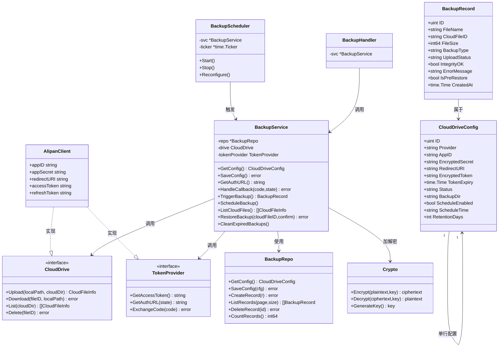
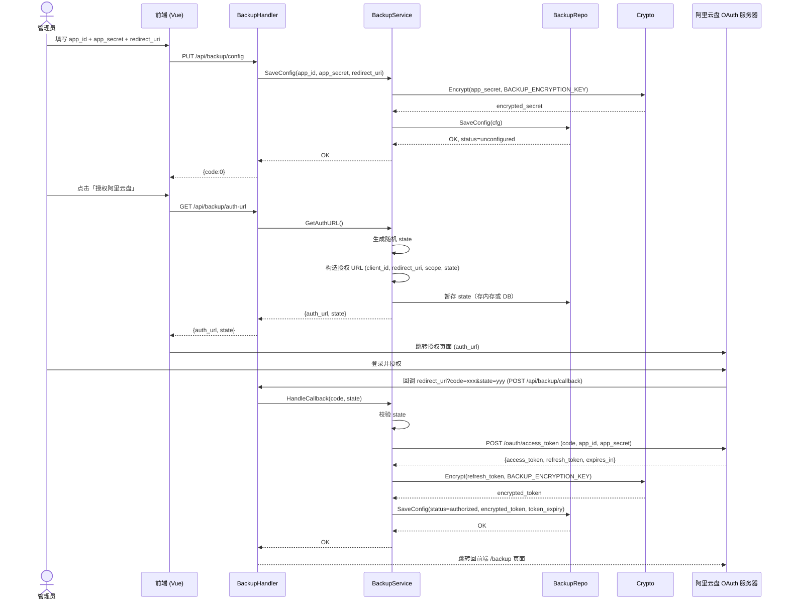
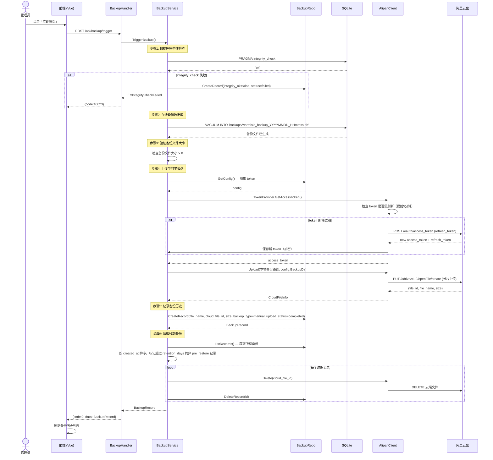
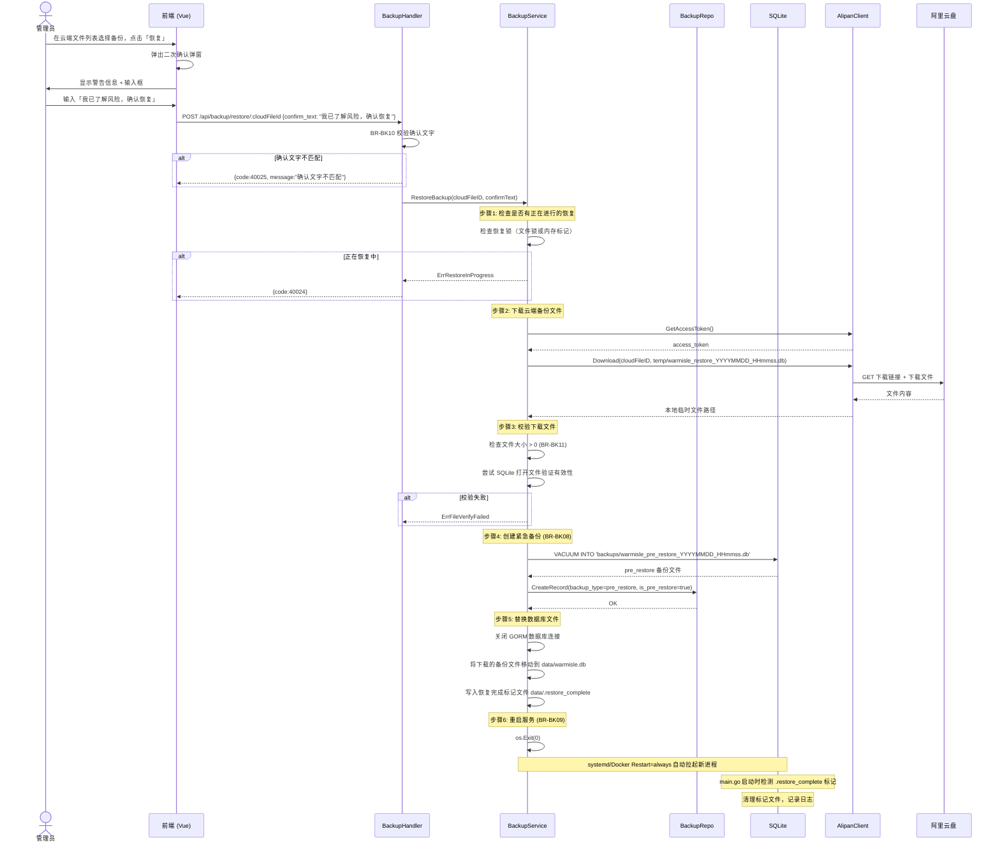
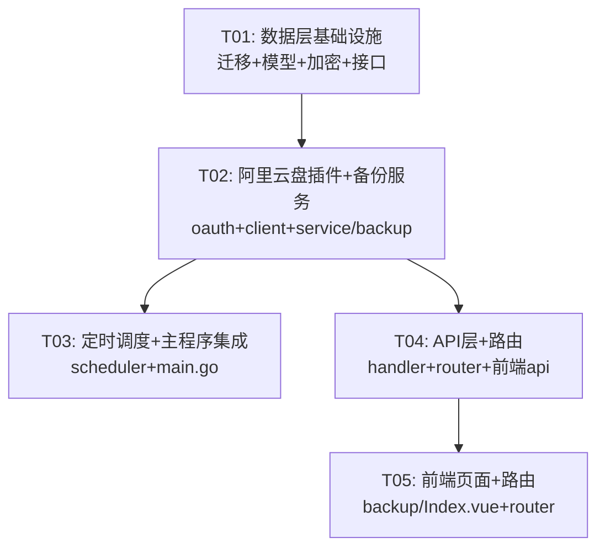

# 暖屿 V1 — 网盘备份模块系统设计文档

> **作者**：高见远（架构师）  
> **日期**：2026-06-19  
> **版本**：v1.0  
> **依赖 PRD**：暖屿 V1 PRD V2.1.0（网盘备份模块 §7.9）

---

## 目录

- [Part A: 系统设计](#part-a-系统设计)
  - [1. 实现方案与框架选型](#1-实现方案与框架选型)
  - [2. 文件列表](#2-文件列表)
  - [3. 数据结构与接口](#3-数据结构与接口)
  - [4. 程序调用流程](#4-程序调用流程)
  - [5. 待明确事项](#5-待明确事项)
- [Part B: 任务分解](#part-b-任务分解)
  - [6. 依赖包列表](#6-依赖包列表)
  - [7. 任务列表](#7-任务列表)
  - [8. 共享知识](#8-共享知识)
  - [9. 任务依赖图](#9-任务依赖图)

---

## Part A: 系统设计

### 1. 实现方案与框架选型

#### 1.1 核心技术挑战

| 挑战 | 分析 |
|------|------|
| **阿里云盘 OAuth2 对接** | 阿里云盘开放平台使用标准 OAuth2 Authorization Code 流程，需要处理 state 防 CSRF、token 安全存储、提前5分钟刷新等 |
| **Token 安全存储** | 要求 AES-256-GCM 加密，密钥从环境变量读取。Go 标准库 `crypto/aes` + `crypto/cipher` 原生支持 |
| **备份流程原子性** | 备份前 PRAGMA integrity_check，失败不阻塞系统。使用 SQLite WAL 模式下的在线备份（`VACUUM INTO` 或文件复制 + 校验） |
| **恢复后自动重启** | Go 进程内重启较复杂，采用 `os.Exit(0)` + 外部进程管理器（systemd/Docker）自动拉起 |
| **定时任务** | 每天一次，不需要 cron 表达式，使用 `time.Ticker` + 持久化调度状态即可 |
| **网盘接口插件化** | 定义 Go interface，阿里云盘作为首个实现。未来可扩展其他云盘 |

#### 1.2 框架与库选择

| 决策点 | 选择 | 理由 |
|--------|------|------|
| **阿里云盘 SDK** | 无官方 Go SDK，自行封装 HTTP 调用 | 阿里云盘开放平台仅提供 REST API（`openapi.alipan.com`），无官方 Go SDK。使用标准库 `net/http` + `encoding/json` |
| **OAuth2 流程** | 标准库 `net/http` 实现 | 流程简单（仅 1 个 token endpoint），无需引入 `golang.org/x/oauth2` 增加复杂度 |
| **AES-256-GCM 加密** | Go 标准库 `crypto/aes` + `crypto/cipher` | 原生支持 GCM 模式，无需第三方库 |
| **定时任务** | `time.Ticker` + 数据库状态标记 | BR-BK14 规定每天一次不支持 cron，无需 `robfig/cron` |
| **数据库迁移** | goose（已有） | 与现有项目一致 |

#### 1.3 架构模式

遵循项目现有的**三层架构**：

```
handler（HTTP 请求处理）
  ↓
service（业务逻辑）
  ↓  ↓
repository（数据访问）  plugin（云盘接口）
```

新增的**插件层**位于 service 之下，与 repository 平级：

```
service/backup.go
  ├── repository/backup.go     — 配置和备份历史持久化
  └── plugin/
        ├── interface.go        — CloudDrive 标准接口
        └── alipan/
              ├── oauth.go     — OAuth2 授权
              └── client.go    — 阿里云盘 API 调用
```

#### 1.4 关键技术决策

**决策 1：SQLite 在线备份策略**

使用 `VACUUM INTO '<path>'` SQL 命令（SQLite 3.27+ 支持）代替文件复制。优势：
- 在线执行，不阻塞 WAL 模式的读写
- 自动压缩数据库，生成干净的副本
- 避免文件复制时的不一致风险

**决策 2：服务重启机制**

恢复备份后通过 `os.Exit(0)` 退出进程，依赖 systemd/Docker 的 `Restart=always` 策略自动重启。在 `main.go` 启动时增加一个信号标记文件（如 `data/.restore_complete`），重启后清理该标记。

**决策 3：Token 加密存储**

`app_secret` 和 `refresh_token` 均使用 AES-256-GCM 加密后存入数据库。加密密钥从环境变量 `BACKUP_ENCRYPTION_KEY` 读取，未设置则在首次启动时自动生成并持久化到 `data/backup-encryption.key`（模式同 JWT secret）。

**决策 4：OAuth2 回调处理**

由于是单二进制内网部署，`redirect_uri` 由管理员在阿里云开放平台注册时配置，并在本系统配置中填写一致的值。典型值为 `http://<server-ip>:<port>/api/backup/callback`。

---

### 2. 文件列表

#### 2.1 新建文件

```
backend/
├── migrations/
│   └── 007_add_backup_tables.up.sql          # 数据库迁移（备份相关表）
├── internal/
│   ├── model/
│   │   └── backup.go                          # 备份数据模型
│   ├── repository/
│   │   └── backup.go                          # 备份数据访问层
│   ├── pkg/
│   │   └── crypto.go                          # AES-256-GCM 加密工具
│   ├── plugin/
│   │   └── interface.go                       # 云盘插件标准接口
│   │   └── alipan/
│   │       ├── oauth.go                       # 阿里云盘 OAuth2 授权
│   │       └── client.go                      # 阿里云盘 API 客户端
│   ├── service/
│   │   ├── backup.go                          # 备份核心业务逻辑
│   │   └── backup_scheduler.go                # 定时备份调度器
│   └── handler/
│       └── backup.go                          # 备份 API 处理器

frontend/
└── src/
    ├── api/
    │   └── backup.ts                          # 备份 API 前端客户端
    └── views/
        └── backup/
            └── Index.vue                      # 备份管理页面
```

#### 2.2 修改文件

```
backend/
├── go.mod                                     # 新增依赖声明（如有）
├── main.go                                    # 启动备份调度器、加载加密密钥
├── internal/
│   └── routes/
│       └── router.go                          # 注册备份路由

frontend/
└── src/
    └── router/
        └── index.ts                           # 新增 /backup 路由
```

---

### 3. 数据结构与接口

#### 3.1 GORM 数据模型

```go
// === model/backup.go ===

// CloudDriveConfig 云盘配置（单行记录，provider=alipan）
type CloudDriveConfig struct {
    ID              uint      `gorm:"primaryKey" json:"id"`
    Provider        string    `gorm:"size:20;default:alipan" json:"provider"`
    AppID           string    `gorm:"size:255" json:"app_id"`
    EncryptedSecret string    `gorm:"size:1024" json:"-"`         // AES-256-GCM 加密的 app_secret
    RedirectURI     string    `gorm:"size:512" json:"redirect_uri"`
    EncryptedToken  string    `gorm:"size:2048" json:"-"`         // AES-256-GCM 加密的 refresh_token JSON
    TokenExpiry     time.Time `json:"token_expiry"`
    Status          string    `gorm:"size:20;default:unconfigured" json:"status"`
    //   unconfigured — 未配置 app_id/app_secret
    //   pending_auth  — 已配置但未授权
    //   authorized    — 已授权 token 有效
    //   token_expired — token 已过期且无法刷新
    BackupDir       string    `gorm:"size:255;default:/warmisle-backups/" json:"backup_dir"`
    ScheduleEnabled bool      `gorm:"default:false" json:"schedule_enabled"`
    ScheduleTime    string    `gorm:"size:5" json:"schedule_time"`   // HH:MM，例如 "03:00"
    RetentionDays   int       `gorm:"default:30" json:"retention_days"`
    CreatedAt       time.Time `json:"created_at"`
    UpdatedAt       time.Time `json:"updated_at"`
}

func (CloudDriveConfig) TableName() string { return "cloud_drive_configs" }

// BackupRecord 备份历史记录
type BackupRecord struct {
    ID           uint      `gorm:"primaryKey" json:"id"`
    FileName     string    `gorm:"size:255" json:"file_name"`           // warmisle_backup_20260619_030000.db
    CloudFileID  string    `gorm:"size:255" json:"cloud_file_id"`
    FileSize     int64     `json:"file_size"`                           // 字节
    BackupType   string    `gorm:"size:20" json:"backup_type"`          // manual | scheduled | pre_restore
    UploadStatus string    `gorm:"size:20" json:"upload_status"`        // pending | uploading | completed | failed
    IntegrityOK  bool      `json:"integrity_ok"`                        // PRAGMA integrity_check 结果
    ErrorMessage string    `gorm:"size:1024" json:"error_message"`
    IsPreRestore bool      `gorm:"default:false" json:"is_pre_restore"` // 预恢复备份，不参与清理
    CreatedAt    time.Time `json:"created_at"`
}

func (BackupRecord) TableName() string { return "backup_records" }
```

#### 3.2 数据库迁移（SQL）

```sql
-- 007_add_backup_tables.up.sql

CREATE TABLE cloud_drive_configs (
    id               INTEGER PRIMARY KEY AUTOINCREMENT,
    provider         TEXT NOT NULL DEFAULT 'alipan',
    app_id           TEXT NOT NULL DEFAULT '',
    encrypted_secret TEXT NOT NULL DEFAULT '',
    redirect_uri     TEXT NOT NULL DEFAULT '',
    encrypted_token  TEXT NOT NULL DEFAULT '',
    token_expiry     DATETIME,
    status           TEXT NOT NULL DEFAULT 'unconfigured',
    backup_dir       TEXT NOT NULL DEFAULT '/warmisle-backups/',
    schedule_enabled INTEGER NOT NULL DEFAULT 0,
    schedule_time    TEXT NOT NULL DEFAULT '03:00',
    retention_days   INTEGER NOT NULL DEFAULT 30,
    created_at       DATETIME NOT NULL DEFAULT (datetime('now')),
    updated_at       DATETIME NOT NULL DEFAULT (datetime('now'))
);

CREATE TABLE backup_records (
    id            INTEGER PRIMARY KEY AUTOINCREMENT,
    file_name     TEXT NOT NULL,
    cloud_file_id TEXT NOT NULL DEFAULT '',
    file_size     INTEGER NOT NULL DEFAULT 0,
    backup_type   TEXT NOT NULL DEFAULT 'manual',
    upload_status TEXT NOT NULL DEFAULT 'pending',
    integrity_ok  INTEGER NOT NULL DEFAULT 0,
    error_message TEXT NOT NULL DEFAULT '',
    is_pre_restore INTEGER NOT NULL DEFAULT 0,
    created_at    DATETIME NOT NULL DEFAULT (datetime('now'))
);

-- 初始插入一条空配置
INSERT INTO cloud_drive_configs (provider, status) VALUES ('alipan', 'unconfigured');
```

#### 3.3 关键非数据库数据结构

```go
// === plugin/interface.go ===

// CloudFileInfo 云端文件信息
type CloudFileInfo struct {
    FileID     string    `json:"file_id"`
    FileName   string    `json:"file_name"`
    Size       int64     `json:"size"`
    Path       string    `json:"path"`
    CreateTime time.Time `json:"create_time"`
}

// CloudDrive 云盘操作标准接口（插件化）
type CloudDrive interface {
    // Upload 上传本地文件到云盘指定目录，返回云端文件信息
    Upload(localPath, cloudDir string) (*CloudFileInfo, error)

    // Download 从云盘下载文件到本地路径
    Download(fileID, localPath string) error

    // List 列出云盘指定目录下的文件列表
    List(cloudDir string) ([]CloudFileInfo, error)

    // Delete 删除云盘上的文件
    Delete(fileID string) error
}

// TokenProvider 定义 token 管理能力（OAuth2 接入层需要）
type TokenProvider interface {
    // GetAccessToken 返回有效的 access_token（自动刷新过期 token）
    GetAccessToken() (string, error)

    // GetAuthURL 生成授权页面 URL
    GetAuthURL(state string) string

    // ExchangeCode 用授权码换取 token
    ExchangeCode(code string) error
}
```

#### 3.4 API 路由设计

所有备份路由均要求 **认证 + 管理员权限**：

| 方法 | 路径 | 说明 | 请求体 | 响应 data |
|------|------|------|--------|-----------|
| `GET` | `/api/backup/config` | 获取云盘配置（不含密钥明文） | — | `CloudDriveConfig`（`encrypted_secret`、`encrypted_token` 字段不返回） |
| `PUT` | `/api/backup/config` | 保存云盘配置 | `{app_id, app_secret, redirect_uri, backup_dir}` | `CloudDriveConfig` |
| `GET` | `/api/backup/auth-url` | 获取阿里云盘 OAuth2 授权链接 | — | `{auth_url, state}` |
| `POST` | `/api/backup/callback` | OAuth2 回调（code 换 token） | `{code, state}` | `CloudDriveConfig` |
| `GET` | `/api/backup/status` | 云盘连接状态 | — | `{status, provider, authorized_at}` |
| `POST` | `/api/backup/trigger` | 手动触发备份 | — | `BackupRecord` |
| `GET` | `/api/backup/history` | 本地备份历史列表 | `?page=&page_size=` | `{items: [], total: int}` |
| `DELETE` | `/api/backup/history/:id` | 删除本地备份记录（同步删云端） | — | `null` |
| `GET` | `/api/backup/cloud-files` | 云端备份文件列表 | — | `[{CloudFileInfo}]` |
| `POST` | `/api/backup/restore/:cloudFileId` | 从云端恢复备份 | `{confirm_text}` (必须是"我已了解风险，确认恢复") | `null`（异步执行） |
| `GET` | `/api/backup/schedule` | 获取定时备份配置 | — | `{enabled, time, retention_days}` |
| `PUT` | `/api/backup/schedule` | 保存定时备份配置 | `{enabled, time, retention_days}` | `{enabled, time, retention_days}` |
| `GET` | `/api/backup/restore-status` | 查询恢复任务状态 | — | `{restoring: bool, progress: string}` |

#### 3.5 API 响应格式（统一）

```json
// 成功
{ "code": 0, "message": "ok", "data": { ... } }

// 错误
{ "code": <业务错误码>, "message": "<错误描述>", "data": null }
```

#### 3.6 业务错误码

| 错误码 | 含义 |
|--------|------|
| 40401 | 备份配置不存在 |
| 40020 | OAuth2 授权失败 |
| 40021 | Token 已过期且无法刷新 |
| 40022 | 云盘连接未配置 |
| 40023 | 备份文件完整性检查失败 |
| 40024 | 正在恢复中，请稍后操作 |
| 40025 | 确认文字不匹配（二次确认失败） |
| 40026 | 云端文件不存在 |
| 40027 | 文件大小校验失败 |
| 50010 | 备份上传失败 |
| 50011 | 备份恢复失败 |

---

### 4. 程序调用流程

#### 4.1 类图



#### 4.2 时序图：OAuth2 授权流程



#### 4.3 时序图：手动备份流程



#### 4.4 时序图：恢复备份流程



---

### 5. 待明确事项

| 编号 | 问题 | 影响 | 建议 |
|------|------|------|------|
| U01 | **OAuth2 redirect_uri 实际值**：内网部署环境下，阿里云盘开放平台是否允许 `http://localhost` 或内网 IP 作为回调地址？ | 影响 OAuth2 流程可行性 | 需实际测试。备选方案：使用 `127.0.0.1` 回环地址，或支持 `urn:ietf:wg:oauth:2.0:oob` 手动授权码模式 |
| U02 | **备份文件命名中的时间**：使用 UTC 还是本地时间？ | 影响文件名和清理逻辑 | 建议使用服务器本地时间（与现有 backupDB 命名一致） |
| U03 | **阿里云盘上传 API 具体端点**：阿里云盘开放 API 文档中文件上传的具体端点和分片方式 | 影响 Upload 实现 | 需要查阅阿里云盘开放平台最新文档（`openapi.alipan.com`）。疑似使用 `/adrive/v1.0/openFile/create` + 分片上传 |
| U04 | **恢复后重启策略**：目标部署环境是 Docker 还是裸机 systemd？ | 影响 BR-BK09 实现方式 | 当前 main.go 无信号处理，建议增加 `os.Exit(0)` 返回码，容器/ systemd 配置 `Restart=always` |
| U05 | **OAuth2 scope 确认**：`user:base, file:all:read, file:all:write` 是否为阿里云盘实际支持的 scope？ | 影响授权 URL 构造 | 需确认阿里云盘开放平台实际 scope 名称 |
| U06 | **多管理员并发备份**：是否需要备份锁防止并发触发？ | 影响 TriggerBackup 实现 | 建议使用简单的内存互斥锁（`sync.Mutex`），备份期间拒绝新的触发请求 |

---

## Part B: 任务分解

### 6. 依赖包列表

本项目**不新增**任何 Go 第三方依赖。所有功能使用 Go 标准库实现：

| 功能 | 使用的标准库 |
|------|------------|
| AES-256-GCM 加密 | `crypto/aes`, `crypto/cipher`, `crypto/rand` |
| OAuth2 HTTP 请求 | `net/http`, `net/url`, `encoding/json` |
| 定时任务调度 | `time.Ticker` |
| 文件操作 | `os`, `io`, `path/filepath` |
| 数据库操作 | 现有 GORM + goose |
| 并发控制 | `sync.Mutex` |

---

### 7. 任务列表

> **硬性限制**：共 5 个任务，按依赖顺序排列。每个任务至少包含 3 个文件。

---

#### T01：项目基础设施 — 数据模型 + 加密 + 插件接口 + 数据库迁移

| 属性 | 内容 |
|------|------|
| **任务编号** | T01 |
| **任务名称** | 数据层基础设施：迁移、模型、加密工具、插件接口 |
| **优先级** | P0 |
| **依赖** | 无 |
| **说明** | 建立网盘备份模块的数据基础。创建数据库迁移文件定义表结构，定义 GORM 数据模型，实现 AES-256-GCM 加解密工具，定义云盘插件标准接口。这是所有后续任务的前置条件。 |

**要创建的文件**：

| 文件 | 职责 |
|------|------|
| `backend/migrations/007_add_backup_tables.up.sql` | 创建 `cloud_drive_configs` 和 `backup_records` 两张表，插入初始配置行 |
| `backend/internal/model/backup.go` | 定义 `CloudDriveConfig` 和 `BackupRecord` 两个 GORM 模型 |
| `backend/internal/repository/backup.go` | 备份配置和备份记录的 CRUD：`BackupRepo` 结构体，方法包括 `GetConfig`、`SaveConfig`、`CreateRecord`、`ListRecords`、`DeleteRecord`、`CountRecords`、`GetRecordByID`、`ListExpiredRecords` |
| `backend/internal/pkg/crypto.go` | AES-256-GCM 加密工具：`Encrypt(plaintext, key []byte) ([]byte, error)`、`Decrypt(ciphertext, key []byte) ([]byte, error)`、`GenerateEncryptionKey() ([]byte, error)`。密钥管理：从环境变量 `BACKUP_ENCRYPTION_KEY` 读取或从 `data/backup-encryption.key` 加载（模式与 JWT secret 一致） |
| `backend/internal/plugin/interface.go` | 定义 `CloudDrive` 接口（`Upload`/`Download`/`List`/`Delete`）和 `TokenProvider` 接口（`GetAccessToken`/`GetAuthURL`/`ExchangeCode`），以及 `CloudFileInfo` 结构体 |

---

#### T02：阿里云盘插件 + 备份核心服务

| 属性 | 内容 |
|------|------|
| **任务编号** | T02 |
| **任务名称** | 阿里云盘插件实现与备份业务服务 |
| **优先级** | P0 |
| **依赖** | T01 |
| **说明** | 实现阿里云盘 OAuth2 授权流程和 REST API 客户端，使其满足 `CloudDrive` 和 `TokenProvider` 接口。实现备份核心业务服务，包含手动备份、恢复、清理等完整逻辑。 |

**要创建的文件**：

| 文件 | 职责 |
|------|------|
| `backend/internal/plugin/alipan/oauth.go` | 阿里云盘 OAuth2 实现：`AlipanOAuth` 结构体，包含 `GetAuthURL(state)` 构造 `https://openapi.alipan.com/oauth/authorize` 授权链接、`ExchangeCode(code)` 调用 `https://openapi.alipan.com/oauth/access_token` 换取 token、`GetAccessToken()` 获取有效 token 并提前5分钟自动刷新 (BR-BK12)、`RefreshToken()` 刷新 token。Token 结构体：`AlipanToken{AccessToken, RefreshToken, ExpiresIn, TokenType}` |
| `backend/internal/plugin/alipan/client.go` | 阿里云盘 API 客户端：`AlipanClient` 结构体，实现 `CloudDrive` 接口的四个方法。`Upload` 使用 `openapi.alipan.com` 的文件上传 API（分片上传），`Download` 获取下载链接后下载到本地，`List` 列出目录文件，`Delete` 删除文件。API 域名：`openapi.alipan.com` (BR-BK18) |
| `backend/internal/service/backup.go` | 备份业务服务：`BackupService` 结构体。核心方法：`GetConfig()`、`SaveConfig()`（含加密 app_secret）、`GetAuthURL()`、`HandleCallback()`、`TriggerBackup()`（PRAGMA integrity_check → VACUUM INTO → 上传 → 记录 → 清理过期）、`ListCloudFiles()`、`RestoreBackup()`（下载 → 校验 → 紧急备份 → 替换 DB → 写恢复标记）、`CleanExpiredBackups()`（BR-BK07 按天数清理，跳过 is_pre_restore）、`ScheduleBackup()`（供调度器调用） |

---

#### T03：定时备份调度器 + 服务启动集成

| 属性 | 内容 |
|------|------|
| **任务编号** | T03 |
| **任务名称** | 定时备份调度器与主程序集成 |
| **优先级** | P1 |
| **依赖** | T02 |
| **说明** | 实现每天一次的定时备份调度器，集成到 main.go 启动流程中。处理加密密钥初始化、调度器生命周期管理、恢复后重启检测。 |

**要创建/修改的文件**：

| 文件 | 操作 | 职责 |
|------|------|------|
| `backend/internal/service/backup_scheduler.go` | 新建 | `BackupScheduler` 结构体：使用 `time.Ticker` 实现每天一次定时触发 (BR-BK14)。方法：`Start()` 启动调度循环（计算到下次执行时间的间隔，到点执行 `ScheduleBackup()`）、`Stop()` 停止、`Reconfigure()` 根据配置变更重启 ticker。调度循环中检查 `ScheduleEnabled` 标志 |
| `backend/main.go` | 修改 | 在 `main()` 中：（1）初始化备份加密密钥（从 `BACKUP_ENCRYPTION_KEY` 环境变量或 `data/backup-encryption.key` 加载，模式同 JWT secret）；（2）在路由注册后启动 `BackupScheduler.Start()`，传入 gin.Engine 或通过 service 层启动；（3）处理恢复标记文件 `.restore_complete`：启动时检测并清理，记录日志 |
| `backend/cmd/cli/main.go` | 修改 | 可选：新增 CLI 命令支持备份操作（如 `cli backup-trigger` 命令行触发备份），非必需，视需要而定 |

---

#### T04：后端 API 层 + 路由注册

| 属性 | 内容 |
|------|------|
| **任务编号** | T04 |
| **任务名称** | 备份 API 处理器与路由集成 |
| **优先级** | P0 |
| **依赖** | T02 |
| **说明** | 实现所有备份相关的 HTTP handler，注册路由。遵循项目现有的 handler 模式（请求绑定 → 调用 service → 错误映射 → 响应）。 |

**要创建/修改的文件**：

| 文件 | 操作 | 职责 |
|------|------|------|
| `backend/internal/handler/backup.go` | 新建 | `BackupHandler` 结构体，包含所有 API 端点方法：`GetConfig`、`SaveConfig`、`GetAuthURL`、`Callback`、`GetStatus`、`TriggerBackup`、`ListHistory`、`DeleteHistory`、`ListCloudFiles`、`RestoreBackup`、`GetSchedule`、`SaveSchedule`、`GetRestoreStatus`。使用 `handleServiceError` 模式映射业务错误到 HTTP 响应。定义请求结构体（`saveConfigRequest`、`callbackRequest`、`restoreRequest`、`scheduleRequest`） |
| `backend/internal/routes/router.go` | 修改 | 在 `Register()` 函数中新增备份路由组：`backup := handler.NewBackupHandler()`，所有路由添加 `authRequired` + `adminRequired` 中间件。OAuth2 回调路由 `POST /api/backup/callback` 仅需 `authRequired`（因为从阿里云盘跳回时带 state 验证）或独立处理——注意：callback URL 从外部跳回可能无 JWT token，需要特殊处理（使用 state 验证代替 JWT） |
| `frontend/src/api/backup.ts` | 新建 | 前端 API 客户端：`getConfig`、`saveConfig`、`getAuthUrl`、`callback`、`getStatus`、`triggerBackup`、`listHistory`、`deleteHistory`、`listCloudFiles`、`restoreBackup`、`getSchedule`、`saveSchedule`、`getRestoreStatus`。使用 `request` (axios 实例) 发起请求 |

---

#### T05：前端备份管理页面 + 路由

| 属性 | 内容 |
|------|------|
| **任务编号** | T05 |
| **任务名称** | 前端备份管理页面与路由集成 |
| **优先级** | P1 |
| **依赖** | T04 |
| **说明** | 实现备份管理页面，包含云盘配置、OAuth2 授权引导、备份操作、历史列表、恢复功能。要求使用 Ant Design Vue 组件，遵循项目现有前端风格。 |

**要创建/修改的文件**：

| 文件 | 操作 | 职责 |
|------|------|------|
| `frontend/src/views/backup/Index.vue` | 新建 | 备份管理页面。包含以下 UI 区块：（1）**云盘配置卡片**：app_id、app_secret（密码框）、redirect_uri、backup_dir 输入，保存按钮；（2）**授权状态区域**：显示连接状态（未配置/待授权/已授权/已过期），授权按钮跳转阿里云盘；（3）**定时备份配置**：开关、时间选择器、保留天数输入，保存按钮；（4）**手动备份区域**：触发按钮 + 最新备份状态提示；（5）**备份历史表格**：分页列表，显示文件名、类型、大小、状态、时间、删除操作；（6）**云端文件列表**：显示云盘上的备份文件，每个文件有恢复按钮。恢复按钮弹出二次确认 Modal（BR-BK10，确认文字必须为"我已了解风险，确认恢复"）。整体使用 Ant Design Vue 的 `a-card`、`a-form`、`a-table`、`a-button`、`a-modal`、`a-tag`、`a-switch`、`a-time-picker`、`a-input-number` 等组件。仅管理员可见（路由守卫 `requiresAdmin: true`） |
| `frontend/src/router/index.ts` | 修改 | 新增路由：`{path: '/backup', name: 'Backup', component: () => import('@/views/backup/Index.vue'), meta: {requiresAuth: true, requiresAdmin: true, layout: 'main'}}` |

---

### 8. 共享知识

以下约定贯穿所有文件，工程师实现时需统一遵守：

#### 8.1 统一响应格式

```
所有 API 响应格式：{ "code": 0, "message": "ok", "data": {...} }
code=0 表示成功，非0为业务错误码（见 §3.6）
```

#### 8.2 认证与授权

- 所有 `/api/backup/*` 路由（除 OAuth2 callback 外）均需要 `AuthRequired()` + `AdminRequired()` 中间件
- OAuth2 callback 路由使用 state 参数验证（从阿里云盘回调时不带 JWT），state 存储在内存或 `cloud_drive_configs` 表中
- 从 Gin context 取 member_id：`c.Get("member_id")` → `uint`

#### 8.3 加密约定

- 加密密钥来源：环境变量 `BACKUP_ENCRYPTION_KEY`（hex 编码，32 字节）或自动生成 → `data/backup-encryption.key`
- `app_secret` 和 `refresh_token` 均 AES-256-GCM 加密后存储
- Nonce（12字节随机数）前缀存储：密文 = nonce + 加密数据
- 密钥文件权限 0600

#### 8.4 文件命名约定

- 备份文件：`warmisle_backup_YYYYMMDD_HHmmss.db`（BR-BK05）
- 恢复前紧急备份：`warmisle_pre_restore_YYYYMMDD_HHmmss.db`（BR-BK08）
- 时间戳使用服务器**本地时间**

#### 8.5 备份目录

- 本地备份临时目录：`backups/`（项目根目录下，与现有 backupDB 一致）
- 云端默认目录：`/warmisle-backups/`，管理员可修改（BR-BK04）
- 下载恢复临时目录：`backups/.restore-tmp/`

#### 8.6 状态常量

| 常量 | 可选值 |
|------|--------|
| `CloudDriveConfig.Status` | `unconfigured`, `pending_auth`, `authorized`, `token_expired` |
| `BackupRecord.BackupType` | `manual`, `scheduled`, `pre_restore` |
| `BackupRecord.UploadStatus` | `pending`, `uploading`, `completed`, `failed` |

#### 8.7 并发安全

- 备份操作使用 `sync.Mutex` 互斥锁，防止并发触发
- 恢复操作使用文件锁 `backups/.restore.lock`，重启后自动清理
- 恢复进行中，拒绝新的备份和恢复请求

#### 8.8 错误处理

- Service 层返回 Go error（使用 `errors.New` / `fmt.Errorf`），定义 sentinel errors
- Handler 层使用 `handleServiceError` 映射模式（与现有 handler 一致）
- 备份失败**不阻塞系统**（BR-BK16），仅记录日志和备份历史中的 error_message
- Token 刷新失败时，将状态设为 `token_expired`

#### 8.9 阿里云盘 API 约定

- 基础域名：`https://openapi.alipan.com`（BR-BK18）
- OAuth2 授权端点：`/oauth/authorize`
- OAuth2 Token 端点：`/oauth/access_token`
- API 请求头：`Authorization: Bearer {access_token}`
- Scope：`user:base, file:all:read, file:all:write`（BR-BK02）

---

### 9. 任务依赖图



**依赖说明**：
- T01 无依赖，所有任务的共同前置
- T02 依赖 T01（模型、仓库、加密、接口）
- T03 依赖 T02（备份服务）
- T04 依赖 T02（备份服务），**不依赖** T03
- T05 依赖 T04（前端 API 客户端）

**可并行执行**：T03 和 T04 可以在 T02 完成后并行开发。

---

> **文档结束** — 请团队领导分配任务给工程师实现。
